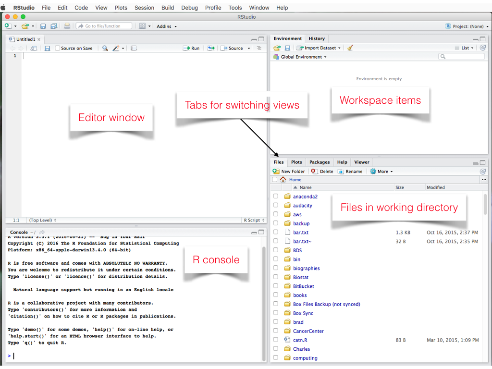
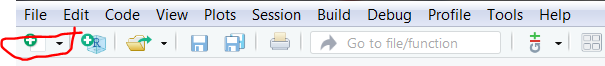
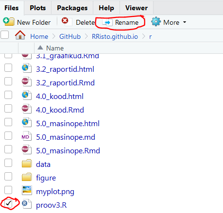

RStudio on Ri programmeerimise integreeritud arenduskeskkond (_integrated development environment_ ehk  IDE). Võttes RStudio lahti, avaneb selline vaade:


Allikas: https://ipam2018ws.rbind.io/post/tutorial/r-studio/

Mõni sõna tähendustest:

- __Editor window__ (editor) - koht, kuhu saab kirjutada koodi. Siia kirjutatud koodi saad salvestada faili. Tegemist on skriptifailiga, mis tuleb luua (vt all olevat juhendit skriptifaili loomiseks).
- __R console__ (konsool) - koht, kus koodi jooksutatakse. Ka siia saab koodi kirjutada ning kohe jooksutada. Siia kirjutatud koodi ei salevstata. See läheb pärast RStudio sulgemist kaduma
- __Workplace items__ (töökeskkonna muutujad) - käesoleva keskkonna muutujad. Siit saad näha, mis muutujad ole juba loonud, mis andmed oled sisse lugenud. Tabi "History" alt näed eelnevaid käske.
- __Files in working directory__ - näed käesoleva projekti faile.
- __Tabs for switching views__ - saad vahetada vaadet, failide asemel vaadata graafikuid (kui sa neid Riga tegema hakkavad tulevad need automaatselt esimeseks vaateks), pakette (mis on üldse sul olemas ja millised neist on aktiivsed) ning otsida abi.


__Projekti loomine__ 

Uus projekti loomiseks võta menüüst "File">"New project". Seejärel vali "New directory", seejärel "New project", seejärel määra, kuhu projekt luuakse (mis kausta) ning projekti nimi (soovitus, ära kasuta tühikuid nimes). Seejärel vajuta nupp "Create poject". Nüüd loodi sulle uus projekt. Projekt tähendab sisuliselt kausta, kus on kõik projekti jaoks vajalikud ressursid. Files tabist näed, mis failid/kaustad on projektis.

Kui nüüd lood projekti uue skriptifaili (koha, kuhu me koodi kirjutame, et saa ka maha salvestuks), peaks see "Files" tabist näha olema paremal all. Uue skripti faili loomiseks: punasega märgitud menüüst vali "R Script":



Avanes fail, kuhu saab midagi kirjutada. Enne salvesta fail: ctrl+s. Anna failile nimi (näiteks "esimene_skript", soovitan jällegi tühikuid vältida).

__Skriptifaili loomine__

Loo uus .R skripti fail. Kirjuta avanenud faili järgnevad read (iga rida eraldi reale):
```{r, eval=FALSE}
a<-3
b<-4
a+b
```


Märgi eelnevad read ning vajuta ctrl+Enter. Vaata, mis toimub konsoolis ning töökeskkonna muutujate vaadetes.

Salvesta fail kasutades käsku ctrl+s (failile tuleb anda nimi). Nüüd peaksid faili nägema paremas laumises aknas, kui aktiivne on tab "Files".

Kui miskit ei töödanud, kontrolli, kas sinu salvestatud faili lõpus on .R, kui ei ole, saad faili ümber nimetada (märgista fail ja vali "rename" ning lisa nime lõppu .R:




Ja oledki loonud oma (esimese) R skripti!

__Kiirkäsud__

Eelnevas ülesndes kasutasime kiirkäsku ctrl+Enter. Neid on tegelikult veel. Neid võib näha nii menüüdes (nt "View" menüüs on paljudel käskudel kiirkäsu variandid). Lisaks on olemas ka abimaterjale: https://www.rstudio.com/wp-content/uploads/2016/01/rstudio-IDE-cheatsheet.pdf

Kiirkäsud teevad Ri kasutamise oluliselt kiiremaks. Kõiki neid ei lähe vaja (3-5 enimkasutatavat käsku võiks olla küll peas). Ise kasutan põhiliselt neid kahte käsku:

- ctrl+Enter (jooksutab konsoolis koodiread, mis on skriptifailis aktiivseks tehtud)
- ctrl+shift+Enter (jooksutab konsoolis kõik skriptifailis olevad read)
- ctrl+s (salvestab editoris oleva faili)
- ctrl+c (kopeerib aktiivse osa)
- ctrl+p (kleebib kopeeritud osa kohta, kus kursor on aktiivne)