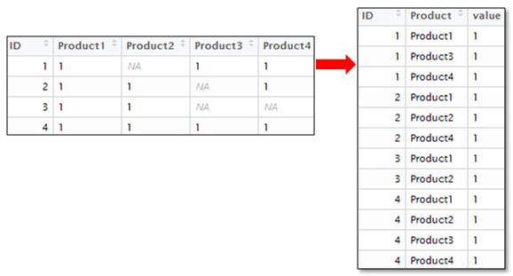

https://towardsdatascience.com/tutorial-data-wrangling-and-mapping-in-r-ec828acc8073
https://programminghistorian.org/en/lessons/data_wrangling_and_management_in_R
https://rpubs.com/bradleyboehmke/data_wrangling

https://rpubs.com/bradleyboehmke/data_processing
https://suzan.rbind.io/2018/01/dplyr-tutorial-1/

### Andmed

Laeme andmed sisse:
```{r}
us_state_populations<-read.csv("data/introductory_state_example.csv")
#esimesed 6 rida andmetest
head(us_state_populations)
```

```{r}
#viimased 6 rida andmetest
tail(us_state_populations)
```

Vaatame, mis andmetes on.
```{r}
str(us_state_populations)
summary(us_state_populations)
```
```{r}
#andmeraami dimensioonid
dim(us_state_populations)
```


### tidyverse

Nüüd jõuab kätte osa, mis on üks oluline R-i populaarsuse faktor. [__Tidyverse__](https://www.tidyverse.org/) on andmeteaduse pakettide kogum. Üheks autoriks on Hadley Wickham, R-i arendajate seas legendaarne kuju:


Miks tidyverse populaarne on, saame kohe näha. Tidyverse paketid saab installida ühe korraga:
```{r, eval=FALSE}
install.packages("tidyverse")
```

Järgnevalt mõned näited tidyverse'i kogumist.

### Filtreerimine

Ütleme, et tahame filtreerida välja read, mis käivad California ja New York'i kohta:
```{r, message=FALSE}
library(tidyverse)
#tulemus omistatakse muutujale df_california_ny, aluseks võtame andmed
#muutujast us_state_populations
df_california_ny<-us_state_populations %>% 
  #filtreerimne välja osariigid, millen nimed on alltoodud vekto  ris c(...)
  filter(state %in% c("California", "New York"))
dim(df_california_ny)
head(df_california_ny)
```
Eelnevalt me kasutasime pipe oprtaatorit (%>%). See on väga mugav vahend, mitme operatsiooni üksteise järgi tegemiseks. Näiteks me tahame leida keskmist elanike arvu Californias ja New Yorkis kogu vaadeldava perioodi kohta (st iga aasta on kaaluga 1).

Ilma pipe operaatorita näeb see välja nii:
```{r}
us_state_populations %>% 
  #filtreerimne välja osariigid, millen nimed on alltoodud vektoris c(...)
  filter(state %in% c("California", "New York"))%>%
  #grupeerime osariigi järgi
  group_by(state)%>%
  #arvutame iga grupi kohta keskmise ja st. hälve
  summarise(keskmine=mean(population), sandardhälve=sd(population))

```
Samuti saame pipe kasutada, et saada ülevaade mingist osast andmetest:
```{r}
#populatsioon alates aastast 1900
us_state_populations %>%
  select(year, population) %>%
  filter(year>=1900)%>%
  glimpse()
```
```{r}
#populatsioon kogu perioodi kohta
us_state_populations %>%
  select(state, population) %>%
  glimpse()
```


Võime muutujaid valida ka veeru nimes sisalduvate sõnamustrite abil

```{r}
us_state_populations %>%
  #otsib veerge mis sisaldavad mustrit "pop" ja lõppevad tähtedega "ion"
  select(contains("pop"), ends_with("ion")) %>%
  glimpse
```
Veergude ümbernimetamine:
```{r}
us_state_populations %>% 
  rename(population=population, aasta = year, osariik=state) %>%
  glimpse
```

## Muutujate loomine/ muutmine

Kui meil on vaja luua uusi muutujaid, siis me oleme seda juba teinud, kui arvutasime keskmise. Vahel on vaja muutujaid aga ümber arvutada. Näiteks tahame populatsiooni kujutada tuhandetes.
```{r}
us_state_populations<-us_state_populations %>% 
  #mutate loob uue muutuja
  mutate(population_thousand=population/1000)

head(us_state_populations)
```
Tahame osariigi nimed sättida nii, et nad oleks väiketähtedega ja kokku kirjutatud. __Miks see kasulik on?__
```{r}
#asendame tühikud alakriipsuga
us_state_populations$state=gsub(" ", "_", us_state_populations$state)
#teeme väiketähtdeks
us_state_populations$state=tolower(us_state_populations$state)
head(us_state_populations)
```

Nii, nüüd on vaja luua uus muutuja, mis on kategooriline muutuja (faktor), mis näitab perioodi 5-aastaste intervallidena.


```{r}
#cut lõikab muutuja faktoriteks
us_state_populations$period<-cut(us_state_populations$year,  
    #seq genereerib intervalli arvude vahele
    seq(min(us_state_populations$year)-1,
        max(us_state_populations$year)+1,5))
#kontrollime, kas iga aasta kohta on üks intervall
table(us_state_populations$year, us_state_populations$period)[1:5,1:6]
```

## Puuduvad väärtused

Puuduvad andmed on problemaatilised. Me saame kontrollida, kui paljudes veergudes on puuduvad väärtused (NA - not available).
```{r}
colSums(is.na(us_state_populations))
```
Mida puuduvate väärtustega teha? Ideaalis tuleks need väärtused leida. Kui see pole võimalik, tuleks aru saada, miks need väärtused on puudu. Võib-olla saab need asendada keskmise mediaani, moodiga? Üks võimalus oleks luua kategooriline muutuja, mis näitab, kas väärtus oli puudu või mitte. Halvim valik oleks andmete eemaldamine!
```{r}
#mis aastatel puudub period väärtus?
us_state_populations[is.na(us_state_populations$period),]$year
#meie puhul on siin tegemist näpukaga.

```

```{r, eval=FALSE}
#kui me tahame eemaldada read, kus on puuduvad väärtused, saab seda teha järgnevalt
us_state_populations[complete.cases(us_state_populations), ]
```

Puuduvate väärtuste eemaldamiseks mingi funktsiooni kasutamisel on tihti funktsioonidel võimalus anda argument na.rm=T. Arvutuslike operatsioonide puhul on see vajalik, kuna puuduvad väärtused muudavad arvutuste tegemise keerukaks (kuidas puuduvast väärtustest kesmist võtta?).

## Andmete ühendamine

Meil on veel andmeid osariikide kohta:
```{r}
df_states=read_csv('data/states.csv')
head(df_states)
dim(df_states)
```
Ühendamiseks kasutame osariigi nime. Enne peame veenudma, et need klapiks kahes andmehulgas.
```{r}
unique(df_states$state)
```

```{r}
unique(us_state_populations$state)
```

Ei klapi, teeme väiketähtedeks ja asendame tühikud:
```{r}
df_states$state=gsub(" ", "_", df_states$state)
df_states$state=tolower(df_states$state)
unique(df_states$state)
```
Ühendame kaks andmehulka:
```{r}
df=merge(us_state_populations, df_states,by.x='state', by.y='state')
head(df)
```
Kõikide osariikide kohta meil infot pole. Uurime, kas kõik osariigid on algses andmehulgas olemas.
```{r}
dim(df); dim(us_state_populations)
```

```{r}
us_state_populations %>%
  group_by(year) %>%
  summarise(unique_states=length(unique(state)))
  
```
Millised osariigid on puudu?

```{r}
setdiff(unique(us_state_populations$state), unique(df$state))
```
Praegu elame üle, et need välja jäävad, reaalses elus peame tähelepanelikult vaatama, mida me teeme.

## Pikk ja lai formaat

Üldjuhul meeldivad Rile, kui andmed on pikas formaadis. Pikk formaat on:

  - iga muutuja on eraldi veerus
  - iga vaatlus on eraldi real
  - iga vaatlusühik moodustab eraldi tabeli
  


Meie algsed andmed on pikas formaadis
```{r}
head(us_state_populations)
```
Teeme selle laiaks formaadiks

```{r}
library(tidyr)

# The arguments to spread():
# - data: Data object
# - key: Name of column containing the new column names
# - value: Name of column containing values
data_wide <- spread(us_state_populations[,c('year','state','population')], year, population)
head(data_wide)
```
Kui aga tahame tagasi pikaks formaadiks teha:
```{r}
library(reshape2)
data_long<-melt(data_wide, id=c("state"))
tail(data_long)
```

## Apply jne

Mõnda aega tagasi mainisin, et pole mõistlik tsükkleid kasutada. Selle asemel on parem kasutada apply perekonna funktsioone. Arvutame iga aasta maksimumi laias formaadis.

```{r}
apply(data_wide[,2:ncol(data_wide)], 2, max, na.rm=T)
```
Lisaks on funktsioonid sapply, lapply, mapply jne. Üldjuhul saab alguses ilma nendeta hakkama. Kui muidu ei oska, saab ka tsüklit kasutada.
