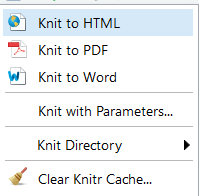

R-iga on võimalik väga lihtsalt teha raporteid. Vaikimise saab kasutada pakette "rmarkdown" või "rnotebook". Need on vaikimisi RStudios olemas. Raporti loomiseks: File -> New File -> R Notebook või R Markdown. Seejärel saad anda raportile pealkirja ja valida, mis tüüpi raportit tahad (kas HTML või PDF). PDF failide genereeririmiseks tuleb enne installida MiKTex, juhend selle kohtao on siin: https://miktex.org/howto/install-miktex

Mõlemad (R Markdown kui ka R Notebook) võimaldavad luua raporteid/artikleid, kus tekst on vaheldumisi koodiga ja tulemustega. Miks seda vaja on? Esiteks on kogu analüüs näha ja loetav. Igasugused vead tulevad kohe välja ja lugeja näeb, kuidas tulemusteni jõuti. See võimaldab teistel alusandmete kättesaadavuse korral kontrollida, kas nad jõuavad samade tulemusteni.

Teiseks on stiil määratud ja ei pea väga palju mässama joondustega jne. Samuti hoiab see oluliselt aega kokku. Tehes ühe muudatuse, jooksutame kogu raporti uuesti ja ning tulemus on käes.

##Knittimine

Uue raporti loomisel antakse see koos põhjaga. Raporti genereerimiseks tuleb see knittida:

Nüüd näeme tulemust. Nüüd võime olemasoleva osa kustutada (kuni päiseni). Saame kirjutada uues teksti. 
Pealkirjade märkimiseks on "#" (esimene tase), "##" (teine tase) jne. 

__Bold__ ümbritseme teksti "__" märkidega.

_italic_ ümbritseme teksti "_" märkidega.

Kui tahame koodi lisada: dtrl+alt+i. Tekib koodiosa, kuhu saame kirjutada tavalist Ri koodi.

Koodiosale saab määrata mitmeid omadusi:

 - {r, echo=F} - koodi ei prindita raportisse
 - {r, eval=F} - koodi ei jooksutata läbi, ainult kuvatakse raportis
 - {r, cache=T} - kui enne raporti knittimist seda koodiosa ei muudetud, siis võetakse vahemälust eelmine tulemus. Võimaldab raporti genereerimist kiirendada, kui tehakse suuri arvutusi. Miinuseks on, et kui muudame koodiosasid, mis on enne seda, siis selle tulemus ei muutu, kui seda koodiosa ei muuda!
 

Rohkem infot:https://rmarkdown.rstudio.com/articles_intro.html ja  https://www.rstudio.com/wp-content/uploads/2015/02/rmarkdown-cheatsheet.pdf